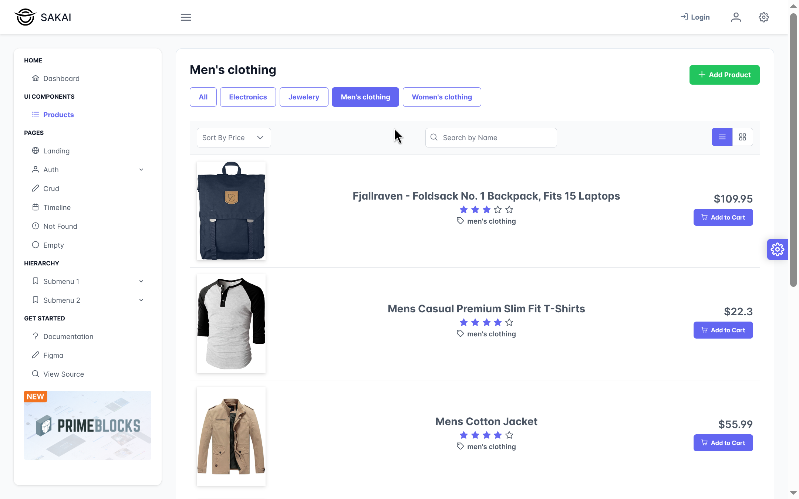

This is a [Next.js](https://nextjs.org/) project bootstrapped with [`create-next-app`](https://github.com/vercel/next.js/tree/canary/packages/create-next-app).

## Steps to run 

First, install the project:

```bash
npm install
```

Second, run the development server:


```bash
npm run dev
# or
yarn dev
# or
pnpm dev
# or
bun dev
```

Open [http://localhost:3000](http://localhost:3000) with your browser to see the result.


# Tech

- Sakai is an open source template free in primeReact which provides nice resources suitable for basic eccomerce project like this.
- Sakai is based on Next Js which is a nice choice for this project.
- Sweet alerts 2 are nice alerts that can improve the UX.

# notes

- You can either log in or visit the site as a guest.
- if you do not see certain buttons, it indicates that you are logged in with a user account that lacks the necessary permissions.

- when the creattion of the product happens it will redirect to the page with the "id" of the new product. It will be 404 because the Fake Store Api doesn't provide the ability to store new data as stated in its docs 

> "Note: Posted data will not really insert into the database and just return a fake id." source: https://github.com/keikaavousi/fake-store-api?tab=readme-ov-file#add-new-product

- As of now, Sakai's PrimeNG and PrimeVue implementations employ more advanced technology than its PrimeReact counterpart. (design token: https://primeng.org/theming). It should be available in the next version of primereact (11).


## features

### list of the products

#### Grid view


#### List View



### add new product

- we must add a valid link in the image url field in order to work


### edit product

click on any of the products in the products page. You will be able to edit the page if you have the permission to do so.


### delete product


## Permissions (Access rights)

#### Definition

the approach is based on Role-Based Access Control (RBAC)

Role Definition:

```ts
export type UserRole = "admin" | "user" | "guest";
```

#### Permission Logic:

- Admins have full permissions for all actions
- Regular users can only update products (not create or delete)
- Guests have no management permissions


#### Implementation Details:

- User data is stored in localStorage after login 
- Before any sensitive operation, the code checks permissions via canPerformAction()
- UI elements (like edit/delete buttons) are conditionally rendered based on permissions
- Unauthorized attempts trigger toast notifications informing the user of permission denial


## To dos


- Routes should be protected with guards (this feature is not yet implemented). 
For example, a guest cant see the "Create" button on the products page. However, this route is still accessible: http://localhost:3000/uikit/products/new